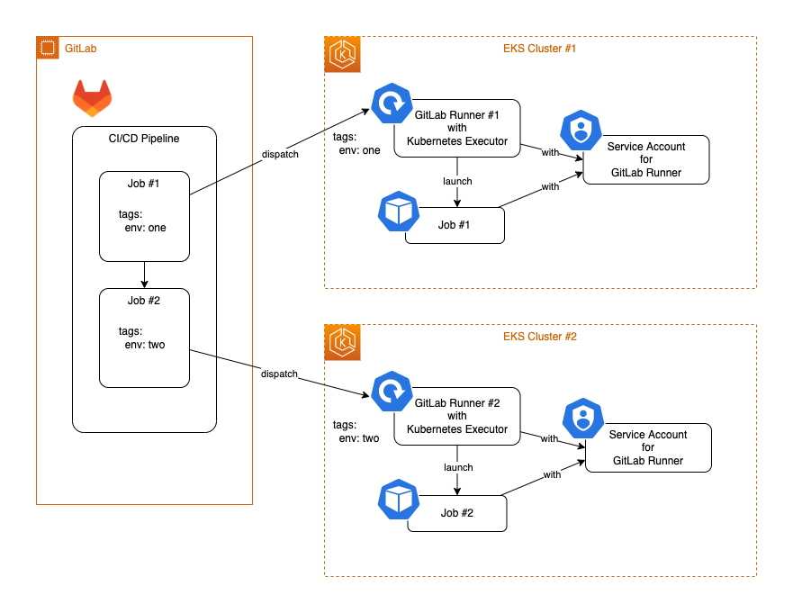

# GitLab CI/CD で kubectl や helm コマンドを使うには、Kubernetes Executor の GitLab Runner を使うのが最も簡単

## TLDR;

もしすでに GitLab Runner を **[Kubernetes Executor](https://docs.gitlab.com/runner/executors/kubernetes.html)**
を使って走らせているのなら、GitLab CI/CD パイプラインで `kubectl` コマンドや `helm` コマンドを使うのはとても簡単です。

例えば下記のジョブのように、何も設定せずに `kubectl` コマンドを使えます。

```yaml
kubectl-job:
  image:
    name: bitnami/kubectl:latest
    entrypoint: [""]
  script:
    - kubectl apply -f mypod.yml
```

`helm` コマンドであれば、下記のようなジョブになります。

```yaml
helm-job:
  image:
    name: alpine/helm:latest
  script:
    - helm repo add myrepo https://...
    - helm repo update
    - helm install myrelease myrepo/mychart
```

この場合、**[GitLab Kubernetes Agent Server (KAS)](https://docs.gitlab.com/ee/administration/clusters/kas.html)** や **[GitLab agent for Kubernetes](https://docs.gitlab.com/ee/user/clusters/agent/install/)** をセットアップする必要はありません。また、Kubernetes クラスターの証明書やアクセストークンなどをコマンドに明治的に渡す必要もありません。

## なぜできるのか？

Kubernetes Executor による GitLab Runner は CI/CD パイプラインのジョブごとにポッドを立ち上げます。そして GitLab Runner とジョブごとに起動されたポッドは、ともに GitLab Runner 用の Service Account の権限で実行されます。

このため、前述の例での `bitnami/kubectl` イメージによる `kubectl-job` は、GitLab Runner 用の Service Account が十分な権限を持っていれば、別の Pod を起動することができます。


## 発展的なユースケース

GitLab は複数の GitLab Runners を持つことができます。そしてジョブと Runner のそれぞれに付与されたタグの組み合わせに応じて、GitLab はジョブの実行に使用する GitLab Runner を決定します。

このため、Kubernetes Executor による GitLab Runner を使うことで、複数の Kubernetes クラスタに跨った GitLab CI/CD パイプラインを走らせることができます。



## `kubectl` コマンドや `helm` コマンドを GitLab CI/CD パイプラインで使うための他の選択肢

- **[GitLab Kubernetes Agent Server](https://docs.gitlab.com/ee/administration/clusters/kas.html)** (KAS) と **[GitLab agent for Kubernetes](https://docs.gitlab.com/ee/user/clusters/agent/install/)** (agentk)

  これは GitLab で推奨されている方法です。ですが、正しく設定するためには、数多くのステップを踏む必要があるのが難点です。

  |      | Kubernetes Executor による GitLab Runner                  | GitLab KAS と agentk                                              |
  | ---- | :-------------------------------------------------------- | :---------------------------------------------------------------- |
  | 長所 | 特別な設定は不要                                          | Kubernetes Executor による GitLab Runner を使うことは必須ではない |
  | 短所 | Kubernetes Executor による GitLab Runner を使うことが前提 | 追加の設定が必要                                                  |

- **[証明書ベースの Kubernetes 連携](https://docs.gitlab.com/ee/user/infrastructure/clusters/)** (非推奨)

  この方法はセキュリティ的な配慮から、現在では非推奨の方法になっています。

- `kubectl` コマンドや `helm` コマンドに認証情報を手動で渡す

  Kubernetes クラスター証明書やアクセストークンなどの認証情報を CI/CD 変数などを使って `kubectl` コマンドや `helm` コマンドに渡すことで、これらのコマンドを使う方法です。
  この場合、**証明書ベースの Kubernetes 連携** と同様に、アクセストークンなどのシークレット情報を GitLab 側に持たせないといけない、という点がデメリットになります。

  |      | Kubernetes Executor による GitLab Runner                  | 証明書ベースの Kubernetes 連携<br>または、認証情報を手動で渡す |
  | ---- | :-------------------------------------------------------- | :------------------------------------------------------------- |
  | 長所 | GitLab 側に認証情報を持たない                             | Kubernetes Executor による GitLab Runner は必須ではない        |
  | 短所 | Kubernetes Executor による GitLab Runner を使うことが前提 | 認証情報を GitLab 側に持たせる必要がある                       |

## どういう時に使えるか？

ArgoCD などで pull ベースの GitOps を採用している場合は別ですが、GitLab CI/CD パイプラインを使って Kubernetes クラスタに対する push ベースの CD を採用している場合には選択肢になります。

前提として GitLab Runner を Kubernetes クラスタ上で動かす、Kubernetes Executor を用いていることが必要になります。

## まとめ

Kubernetes Executor の GitLab Runner を使っているのであれば、**[GitLab Kubernetes Agent Server](https://docs.gitlab.com/ee/administration/clusters/kas.html)** (KAS) と **[GitLab agent for Kubernetes](https://docs.gitlab.com/ee/user/clusters/agent/install/)** (agentk) を設定せずとも、GitLab CI/CD パイプラインで `kubectl` や `helm` コマンドが使えて便利です。

また、タグの仕組みを活用することで、柔軟かつ発展的な使い方も可能になりますので、お勧めな方法です。
