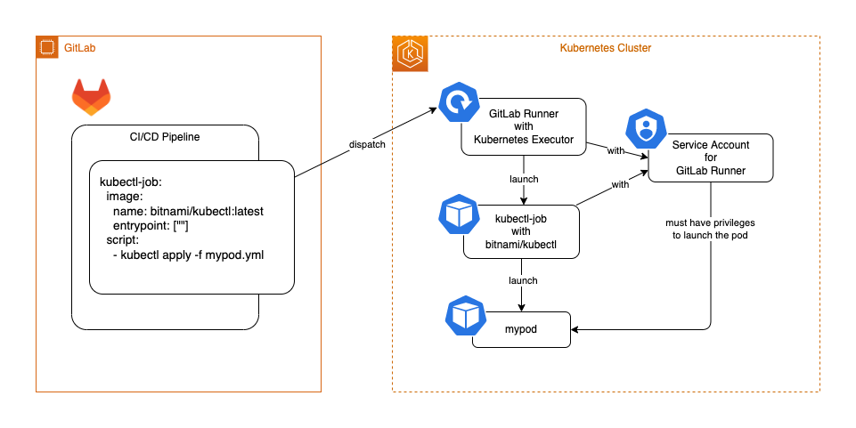
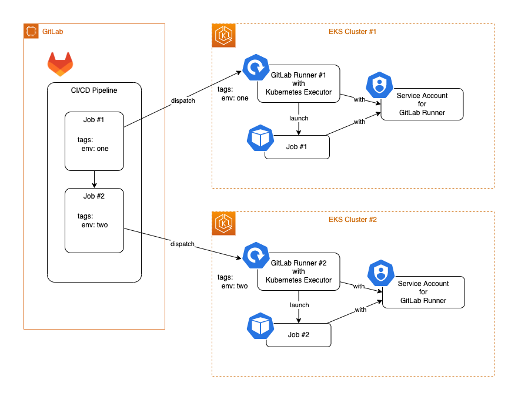

# Using GitLab Runner with Kubernetes Executor is the simplest way to use `kubectl` or `helm` on GitLab CI/CD pipelines

## TLDR;

Using `kubectl` or `helm` command on GitLab CI/CD pipelines is easy, if you already have **[GitLab Runner with Kubernetes Executor](https://docs.gitlab.com/runner/executors/kubernetes.html)**.

For example,

```yaml
kubectl-job:
  image:
    name: bitnami/kubectl:latest
    entrypoint: [""]
  script:
    - kubectl apply -f mypod.yml
```

or

```yaml
helm-job:
  image:
    name: alpine/helm:latest
  script:
    - helm repo add myrepo https://...
    - helm repo update
    - helm install myrelease myrepo/mychart
```

You don't need to pass the access token, the cluster certificates, etc.
Also you don't need to setup **[GitLab Kubernetes Agent Server (KAS)](https://docs.gitlab.com/ee/administration/clusters/kas.html)** and **[GitLab agent for Kubernetes](https://docs.gitlab.com/ee/user/clusters/agent/install/)**.

## Why does this work?

GitLab Runner with Kubernetes Executor launches a Pod for each job in CI/CD pipelines. And both of the GitLab Runner and the launched Pods are executed with the Service Account of the GitLab Runner.

Therefore, the above `kubectl-job` Pod with `bitnami/kubectl` image can launch the another pods, if the Service Account for the GitLab Runner have enough privileges to launch the another pods.



## Advanced Use

GitLab can have multiple GitLab Runners. And it selects a GitLab Runner among them by tags put on both of jobs and runners.
Therefore, you can run CI/CD pipelines accross multiple Kubernetes clusters by using multiple GitLab Runners with Kubernetes Executor and tags.



## What other options are available to use `kubectl` or `helm` on GitLab CI/CD pipelines?

- **[GitLab Kubernetes Agent Server](https://docs.gitlab.com/ee/administration/clusters/kas.html)** (KAS) and **[GitLab agent for Kubernetes](https://docs.gitlab.com/ee/user/clusters/agent/install/)** (agentk).

  This is the recommended way by GitLab. But this requires many steps to configure them properly.

  |      | GitLab Runner with Kubernetes Executor             | GitLab KAS and agentk                                        |
  | ---- | :------------------------------------------------- | :----------------------------------------------------------- |
  | Pros | No additional configurations                       | Using GitLab Runner with Kubernetes Executor is NOT required |
  | Cons | GitLab Runner with Kubernetes Executor is required | Additional configurations are required to use                |

- **[Certificate based Kubernetes Cluster](https://docs.gitlab.com/ee/user/infrastructure/clusters/)** (DEPRECATED)

  This way is deprecated now, due to the security considerations.

- Passing the credentials to `kubectl` or `helm` by manual

  You can use `kubectl` or `helm` by passing the access token, the cluster certificate, etc. via CI/CD variables.
  You have to have secrets like access token, etc. on the GitLab, as same as the **Certificate based Kubernetes Cluster**.

  |      | GitLab Runner with Kubernetes Executor             | Certificate based Kubernetes Cluster<br>and passing credentials by manual |
  | ---- | :------------------------------------------------- | :------------------------------------------------------------------------ |
  | Pros | No credentials on the GitLab                       | Using GitLab Runner with Kubernetes Executor is NOT required              |
  | Cons | GitLab Runner with Kubernetes Executor is required | Credentials are stored on the GitLab                                      |
